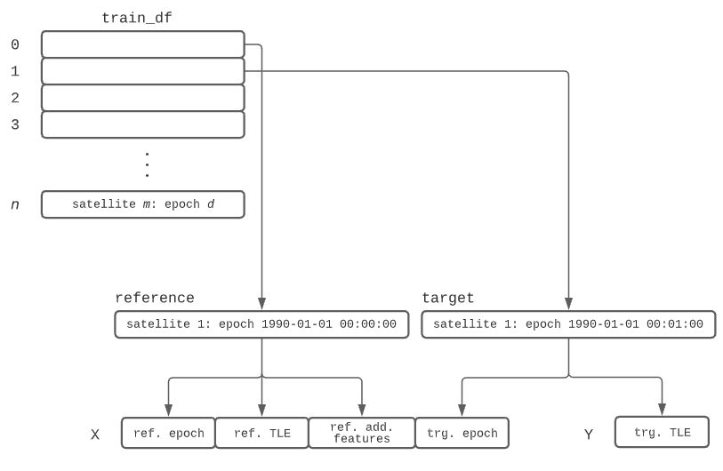
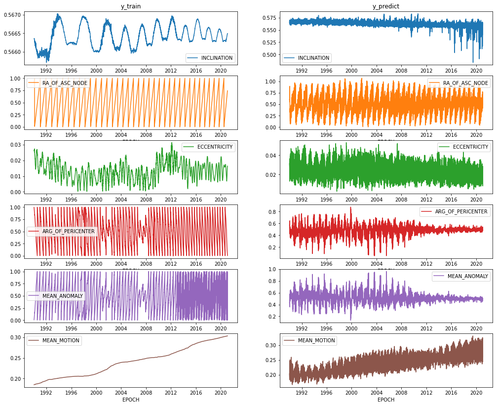
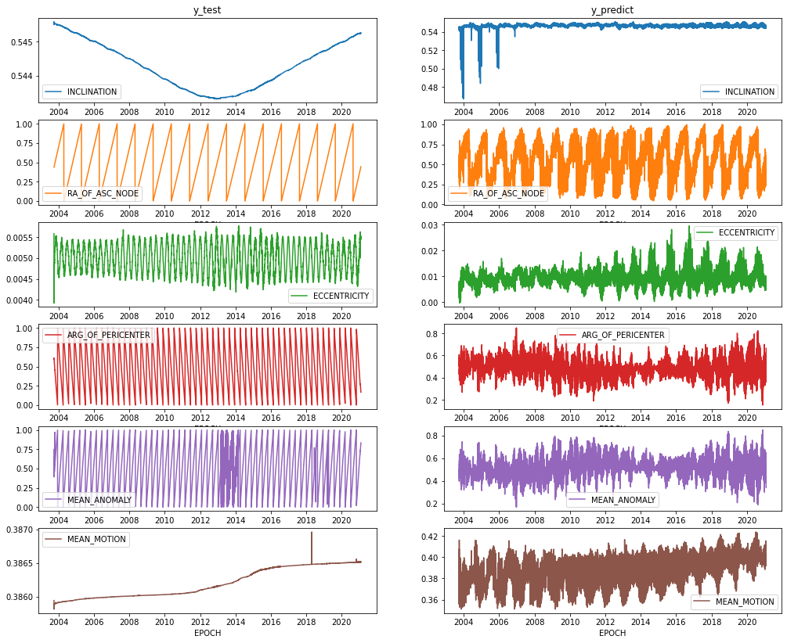

June 1, 2021

<dl>
<dt>Project Team</dt>
<dd>Nicholas Miller* (nmill@umich.edu)</dd>
<dd>Tim Chen* (ttcchen@umich.edu)</dd>
<dt>Github Repository</dt>
<dd><a href='https://github.com/cm-tle-pred/tle-prediction'>https://github.com/cm-tle-pred/tle-prediction</a></dd>
</dl>

\* equal contribution

# Table of Contents
<!-- TOC depthFrom:1 depthTo:3 withLinks:1 updateOnSave:1 orderedList:0 -->

- [Table of Contents](#table-of-contents)
- [Introduction](#introduction)
- [Supervised Learning](#supervised-learning)
	- [Supervised Learning Methods](#supervised-learning-methods)
		- [Workflow and Learning Methods](#workflow-and-learning-methods)
		- [Model Tuning](#model-tuning)
		- [Challenges and Solutions](#challenges-and-solutions)
	- [Evaluation](#evaluation)
	- [Failure Analysis](#failure-analysis)
- [Unsupevised Learning](#unsupevised-learning)
	- [Motivation](#motivation)
	- [Data Source](#data-source)
	- [Unsupervised Learning Methods](#unsupervised-learning-methods)
	- [Unsupervised Evaluation](#unsupervised-evaluation)
- [Discussion](#discussion)
- [Statement of Work](#statement-of-work)
- [Appendix](#appendix)
	- [A. What is a TLE?](#a-what-is-a-tle)
	- [B. Building the X-inputs and y-outputs](#b-building-the-x-inputs-and-y-outputs)
	- [C. Simple Neural Network Investigation](#c-simple-neural-network-investigation)
	- [D. Models Learning Data shape](#d-models-learning-data-shape)

<!-- /TOC -->

# Introduction
Satellite positions can be calculated using publically available TLE (two-line element set) data.  See [Appendix A. What is a TLE?](#a-what-is-a-tle).  This standardized format has been used since the 1970’s and can be used in conjunction with the SGP4 orbit model for satellite state propagation.  Due to many reasons, the accuracy of these propagations deteriorates when propagated beyond a few days.  Our project aimed to create better positional and velocity predictions which can lead to better maneuver and collision detection.

To accomplish this, we created a machine learning pipeline that takes in a TLE dataset and is split it into train, validate and test sets. The training set is then sent to an unsupervised model for anomaly detection outliers are removed and then feature engineering is performed.  Finally, supervised learning models were trained and tuned based on the validation set.

Our models were trained on low-earth orbit (LEO) space debris objects with the expectation that they have relativily stable orbits.  This means, active satellites that can maneuver weren't used.  The resulting dataset, collected from [Space-Track.org](https://www.space-track.org/) via a public API, produced over 57 million TLE records for more than 21 thousand objects.

The general structure of our model was to have an input consisting of a reference TLE with its epoch along with a target epoch from another TLE for the same satellite with the output being that target's TLE data.  A performant model could then use the output in the SGP4 model for predicting a satellite's position at the target epoch.  The performance of the model would measured by comparing the model results with the actual target TLE.  Knowing that errors exist within the TLE, the expectation was that training on such a massive dataset would force the model to generalize and thus accurately predict TLEs.

[Back to Top](#table-of-contents)
# Supervised Learning

## Supervised Learning Methods
> * Briefly describe the workflow of your source code, the learning methods you used, and the feature representations you chose.
> * How did you tune parameters?
> * What challenges did you encounter and how did you solve them?

*We plan to start with a Linear Regression and a simple NN with a single layer using a sample of the dataset as baseline models before moving on to a deep neural network (DNN).  Our data will consist of a normalized set of TLE variables with a target epoch as our input variables and the normalized TLE variables at the target epoch as the output variables. To account for natural effects that impact orbital mechanics, we will combine additional datasets on climate change, global temperature, solar cycles, and solar sunspot to improve accuracy.*

---

### Workflow and Learning Methods

#### Pre-Processing
After the raw data was collected, we used multi-threading and multi-processing to identify the satellites to be used in our train and tests sets utilizing a 70/15/15 split.  We created another dataset by scraping the [International Laser Ranging Services](https://ilrs.gsfc.nasa.gov) website to identify a list of satellites that have more accurate positional readings that we could use as our final evaluation metric.  We then our data into a train, validate and test set, where all TLEs for a given satellite would wholey reside within only one of the sets to prevent data leakage.  Multi-threading and multi-processing was again used to build the complete train, validation and test TLE datasets.

A TLE can be used to calculate some features that might be helpful in model training.  Some of these features, like `semimajor axis`, `period`, `apoapsis` and `periapsis` were already included in the data collection and thus were added into our datasets.  Other features like satellite position and velocity of the reference TLE were calculated using SGP4 and added into our datasets.

Since solar weather and atmospheric temperature have shown to impact the orbit of satellite orbit, two additional datasets were collected and included in our datasets.  These included the following:

 - **Sunspots** - Sunspots are a proxy for solar radiation which has been shown to increase the drag on satellites resulting in faster deorbits.  Using the epoch of the TLE, the daily, 3-day and 7-day average sunspot counts were added to the dataset.
 - **Temperature** - Global warming has shown to lower the density of the upper atmosphere causing decreased satellite drag.  Using the epoch of the TLE, the monthly average global air and water temperatures were added to the dataset.

The data was also filtered to remove outliers which could be the result of deorbiting satellites or simply bad data.  For this reason, the following filters were applied:

 - **Recent data check** - we only considered TLEs gathered from 1990 onwards.
 - **First few check** - we rejected the first five TLEs of every satellite after launch or discovery
 - **LEO check** - if satellite was no longer in LEO, we rejected those new TLEs
 - **Data range check** - various checks for bad data to ensure the features were within an expected range.  For example, features which should be within a range of 0-180 or 0-360 degrees depending on the feature.
 - **Anomaly detection** - For more details, please read the [Unsupevised Learning](#unsupevised-learning) section.


 [Back to Top](#table-of-contents)
#### Feature Engineering
To prepare the data for training, the training dataset was split into inputs and outputs.  This method was different based on the model being trained.  The general approach was that each satellite would have a set of reference TLEs and target TLEs paired together.  In one approach, the epoch difference between the reference and the target was limited to 14 days.  In another approach, there was no limit so it was possible a refernce TLE from 1990 could be used to predict the satellite's TLE in the year 2021.  See Appendix [B. Building the X-inputs and y-outputSize](#b-building-the-x-inputs-and-y-outputs) for more details.

The inputs were then reduced to include the reference features and the target epoch.  The outputs were also reduced to include the following predicted features:

- Inclination
- Right Ascension of the Ascending Node
- Eccentricitiy
- Argument of Perigee
- Mean Anomaly
- Mean Motion
- B-star - Some models didn't predict this and instead expected to use a constant of `0.01`

To prepare the inputs and outputs for training, they were generally normalized either between `0` and `1` or between `-1` and `1`.  Features with known lower and upperbound used min-max normalization to reduce the feature to between `0` and `1`.  Epochs were split into several features representing `year`, `month`, `day`, `hour`, `minute`, `second`, `microsecond`.  And cyclic features, like `day`, were generally split into two features: a sine and cosine transformation thus resulting in features between `-1` and `1`.  Depening on the model, the same feature may have used min-max normalization, standardization or cyclic transformation.  In our research, the cyclic transformation on cyclic features out performed min-max normaliztion and using a min-max between `0` and `1` and between `-0.5` and `0.5` made no difference.


[Back to Top](#table-of-contents)
#### Models
Pytorch was the library selected for building and training a model.  At first, a simple fully-connected network consisting of only one hidden layer was created and trained.  Deeper networks with varying number of hidden layers and width were created, utilizing the ReLU activation function and dropout.  More advanced models were employed next including a ResNet28 model and a Bilinear model.

### Model Tuning
To get a feel for how a model would train and could be evaluated, the simple fully-connected neural network with only one hidden layer was trained and hyperparameters were tuned.  Due to the size of the training set, a subset of the training set was also used.  During this investigation, changes to data filtering were made to eliminate the training on bad data.  See Appendix [C. Simple Neural Network Investigation](#c-simple-neural-network-investigation) for further details.

In later models, SGD and AdamW optimizers were experimented with.  AdamW resulted in faster learning so was generally preferred.  Understanding the AdamW doesn't generalize as well as SGD, we relied on our volume of data and utilizing dropout for generalizing and never ran into issues with overfiitting.  At this stage, the models were showing some progress in capturing the shape of the data.  See Appendix


### Challenges and Solutions

## Evaluation
> * Provide a correct and comprehensive evaluation, analyzing the effectiveness of both your methods, and your feature representations. Methods include e.g. ablation tests to identify important features, hyperparameter sensitivity, and training data curves. This should be done for each learning framework and representation choice, together with a valid and effective comparison between the chosen approaches.
> * Which features were most important and why?
> * What important tradeoffs can you identify?
> * How sensitive are your results to choice of parameters, features, or other varying solution elements?

*Mean square error on the baseline models’ predictions will be used as benchmarks for evaluation.  We will also consider using a custom loss function on predicted spatial x, y, z positions.  To visualize the model's effectiveness, we can plot propagated satellite positions using the SGP4, our baseline models, the DNN model against the true dataset (other TLEs) together in 3D.  Visualizing the errors for the models based on individual feature variances will also show where the strengths and weaknesses of the models lie.*

---


## Failure Analysis
> * Select three examples where prediction failed, and analyse why. You should be able to find at least three different types of failure.


# Unsupevised Learning
*Due to the impact of bad TLE data on the supervised learning models, we want to use unsupervised learning to remove these abnormal data from the dataset before training the data.*

## Motivation
> 1. Briefly state the nature of your work and why you chose it.
> 2. What specific question, goal, or task did you try to address related to structure in the data (e.g. the clusters you found)?

## Data Source
> Describe the properties of the dataset (or data API service) you used. Be specific. Your i nformation at a minimum should include but not be l imited to:
>
> * where the datasets or API resource i s l ocated,
* what formats they returned/used,
* what were the i mportant variables contained i n them,
* how many records you used or retrieved (if using an API), and
* what time periods they covered (if there i s a time element)
>
> For example, if you downloaded data or used API services, you should state the specific URLs to those files or resources in a way that is trivial for the instructor to retrieve them if needed.

## Unsupervised Learning Methods
> * Briefly describe the workflow of your source code, the learning methods you used, and the feature representations you chose.
> * How did you tune parameters?
> * What challenges did you encounter and how did you solve them?

*Anticipated data manipulation includes normalizing features, handling cyclic data, and treating variance in time series intervals.  Since the data anomaly usually applies to all features in a single data point, we will be trying out LocalOutlierFactor and DBSCAN from scikit-learn on highly predictive TLE features such as eccentricity and inclination.*

## Unsupervised Evaluation
> * What i nteresting relationships or insights did you get from your analysis?
> * What didn't work, and why?
> * To summarize your findings, i nclude at l east two visualizations (chart, plot, tag cloud, map or other graphic) that summarize your analysis.

*To evaluate our results' quality, we will manually check them against bad data that have been identified previously.  A visualization that will aid the evaluation process is to plot the TLE data out while highlighting the outliers that we removed.  Another exciting visualization that we will create is to plot the frequency of these data points based on when they occurred to see if we can identify additional insights or patterns.*

# Discussion
> * What did you l earn from doing Part A? What surprised you about your results? How could you extend your solution with more time/resources?
> * What did you l earn from doing Part B? What surprised you about your results? How could you extend your solution with more time/resources?
> * What ethical i ssues could arise i n providing a solution to Part A, and how could you address them?
> * What ethical i ssues could arise i n providing a solution to Part B, and how could you address them?

# Statement of Work

<dl>
<dt>Nicholas Miller</dt>
<dd>Data split strategy</dd>
<dd>Feature Engineering</dd>
<dd>Initial neural network models</dd>
<dd>Deep learning ResNet28 model</dd>
<dd>Training and Evaluation</dd>
<dd>Final Report</dd>
<dt>Tim Chen</dt>
<dd>Data collection</dd>
<dd>Unsupervised anomaly detection model</dd>
<dd>Deep learning bilinear model</dd>
<dd>Training and Evaluation</dd>
<dd>Final Report</dd>
</dl>

# Appendix

## A. What is a TLE?
A two-line element set (TLE) is a standardized format for describing a satellites orbit and trajectory.  Below is an example for the International Space Station.

	ISS (ZARYA)
	1 25544U 98067A   08264.51782528 -.00002182  00000-0 -11606-4 0  2927
	2 25544  51.6416 247.4627 0006703 130.5360 325.0288 15.72125391563537
<p align='center'>Example TLE for the International Space Station<br><i>Source: Wikipedia</i></p>

A TLE contains 14 fields, from this, only 9 of these are necessary for the SGP4 algorithm.  A target EPOCH is also necessary for the SGP4 algirthm to proprigate and thus result position and velocity vectors.

- Epoch Year - The year the TLE was calculated
- Epoch Day - The day and fraction of the day the TLE was calculated
- B-star - The drag term or radiation pressure coefficient
- Inclination - Satellite orbit tilt between 0 and 180 degrees
- Right Ascension of the Ascending Node - Ranging from 0 to 360 degrees
- Eccentricitiy - A measure of how circular the orbit is ranging from 0 to 0.25 for LEO satellites
- Argument of Perigee - The angle from the ascending node ranging from 0 to 360 degrees
- Mean Anomaly - The angular position measured from pericenter if orbit was circular ranging from 0 to 360 degrees
- Mean Motion - The angular speed necessary to complete one orbit measured in revolutions per day with a minimum of 11.25 for LEO satellites

[Back to Top](#table-of-contents)
## B. Building the X-inputs and y-outputs



<p align='center'><b>Figure B1</b>  How a X/Y pair was generated</p>


||BSTAR|	INCLINATION|	RA_OF_ASC_NODE|	ECCENTRICITY|	ARG_OF_PERICENTER|	MEAN_ANOMALY|	MEAN_MOTION
|-:|-:|-:|-:|-:|-:|-:|-:|
|0|0.002592|62.2415|180.1561|0.070489|265.6761|86.2771|12.852684|
|1|0.000100|73.3600|345.6887|0.008815|270.3999|88.6911|12.642166|
|2|0.001076|83.0239|250.9465|0.008493|184.3222|175.7249|13.856401|
|3|0.000166|70.9841|207.4830|0.020756|161.3777|199.5075|13.715209|
|4|0.000739|90.1460|192.1834|0.002746|300.4617|59.3655|12.992417|

<p align='center'><b>Table B1</b>  Example Raw Y-outputs (not normalized)</p>

[Back to Top](#table-of-contents)
## C. Simple Neural Network Investigation

|Test L1 Loss | Test L2 Loss | Change History | Time |
|:-|:-|:-|-|
|0.1234|21.7614|norads=10%, epochs=10, batchSize=200,<br> learn=0.0001, device=cpu, loss=l2,<br> num_workers=5, hidden=300|28min 39s|
|0.1235|34.4868|num_workers=20|28min 54s|
|0.1222|30.8207|norads=20%, num_workers=5|53min 47s|
|0.1219|26.2414|norads=5%, tles-after-1990|12min 46s|
|0.1217|0.1226|remove-high-mean-motion|13min 22s|
|0.1211|0.1235|norads=10%|27min 35s|
|0.1221|0.1232|hidden=10|22min 33s|
|0.1330|0.1380|updated mean_motion standardization|24min 16s|
|0.1329|0.1380|norads=5%|12min 36s|
|0.1322|0.1385|run-local|6min 18s|
|0.1302|0.1373|num-workers=10|4min 44s|
|0.1302|0.1373|num-workers=10|4min 44s|
|0.1304|0.0631|remove-high-bstar|4min 37s|
|0.1289|0.0601|hidden=300|8min 31s|
|0.1423|0.0652|hidden1=100, hidden2=100, drop=50%,<br>batchSize=2000, epoch=5|2min 51s|
|0.1397|0.0614|hidden1=300, drop=50%,<br>hidden2=100, drop=50%,<br>hidden3=10, drop=50%,<br>hidden4=10, drop=50%,<br>hidden5=10, drop=50%,<br>batchSize=2000, epoch=10, learn=0.01|6min 12s|

<p align='center'><b>Table C1</b>  Simple Network Change History</p>

For the last few entries, a new model was created that could be initalized with varying number of layers, widths, activation fuctions and dropout:

```python
model = train.create_model(model_cols=model_cols,
                           layer1=300, relu1=True, drop1=0.5,
                           layer2=100, relu2=True, drop2=0.5,
                           layer3=10, relu3=True, drop3=0.5,
                           layer4=10, relu4=True, drop4=0.5,
                           layer5=10, relu5=True, drop5=0.5,
                          )

class NNModelEx(nn.Module):
    def __init__(self, inputSize, outputSize, **kwargs):
        super().__init__()

        network = []
        p = inputSize
        for k,v in kwargs.items():
            if k.startswith('l'):
                network.append(nn.Linear(in_features=p, out_features=v))
                p=v
            elif k.startswith('d'):
                network.append(nn.Dropout(v))
            elif k.startswith('t'):
                network.append(nn.Tanh())
            elif k.startswith('s'):
                network.append(nn.Sigmoid())
            elif k.startswith('r'):
                network.append(nn.ReLU())

        network.append(nn.Linear(in_features=p, out_features=outputSize))
        #network.append(nn.ReLU())

        self.net = nn.Sequential(*network)

    def forward(self, X):
        return self.net(X)
```

	NNModelEx(
	  (net): Sequential(
	    (0): Linear(in_features=X, out_features=300, bias=True)
	    (1): ReLU()
	    (2): Dropout(p=0.5, inplace=False)
	    (3): Linear(in_features=300, out_features=100, bias=True)
	    (4): ReLU()
	    (5): Dropout(p=0.5, inplace=False)
	    (6): Linear(in_features=100, out_features=10, bias=True)
	    (7): ReLU()
	    (8): Dropout(p=0.5, inplace=False)
	    (9): Linear(in_features=10, out_features=10, bias=True)
	    (10): ReLU()
	    (11): Dropout(p=0.5, inplace=False)
	    (12): Linear(in_features=10, out_features=10, bias=True)
	    (13): ReLU()
	    (14): Dropout(p=0.5, inplace=False)
	    (15): Linear(in_features=10, out_features=Y, bias=True)
	  )
	)


[Back to Top](#table-of-contents)
## D. Models Learning Data shape

For the satellite NORAD 10839, the Mean Motion and Right Ascension of the Ascending Node are starting to take shape.



The same can be seen in NORAD 27944.

