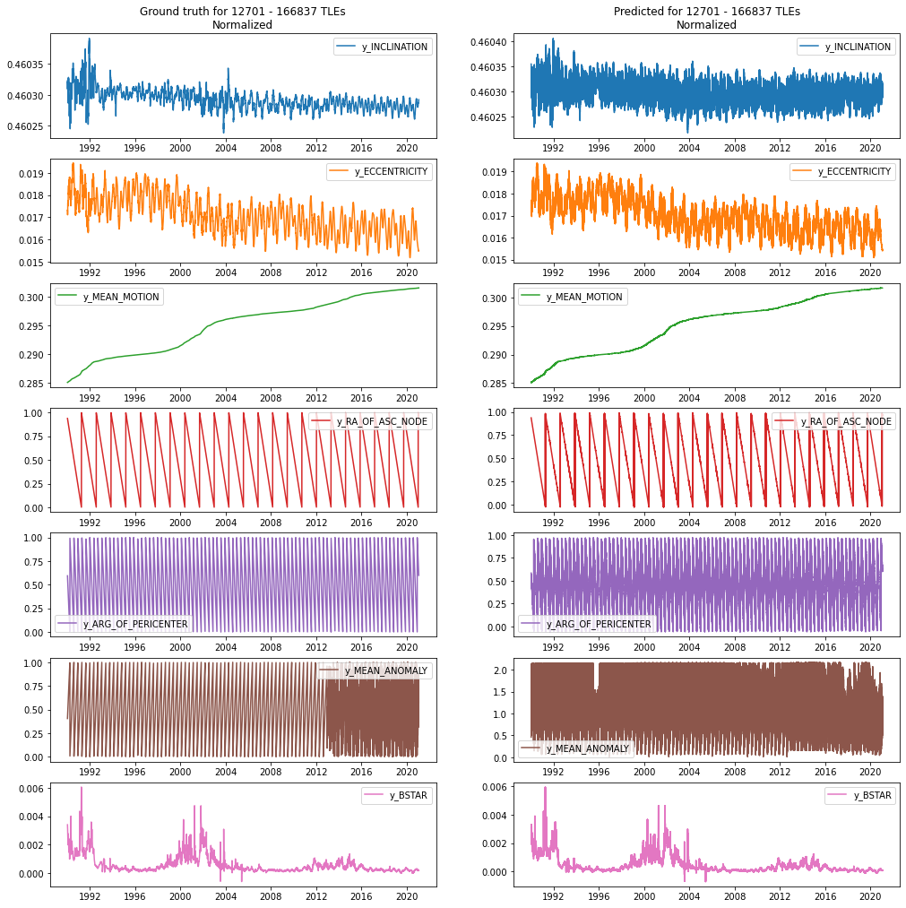
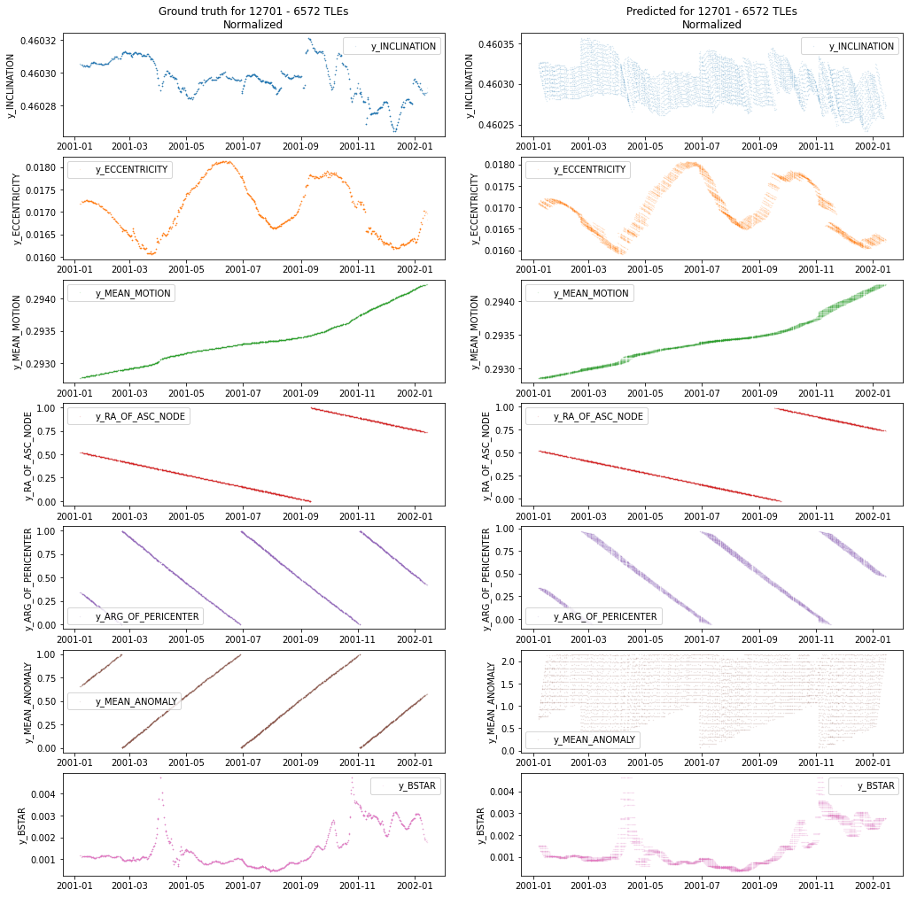
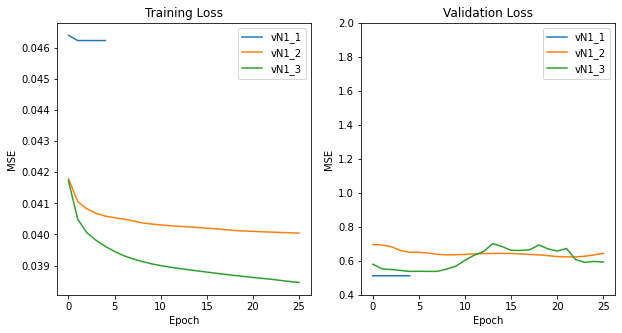
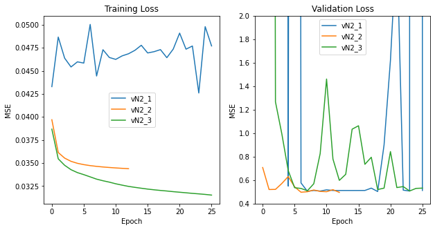
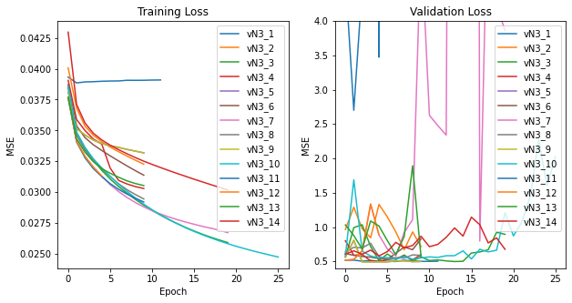
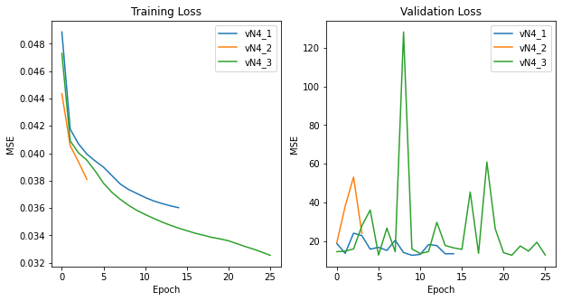
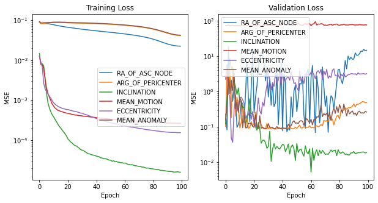
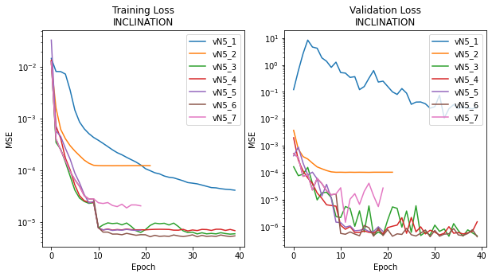
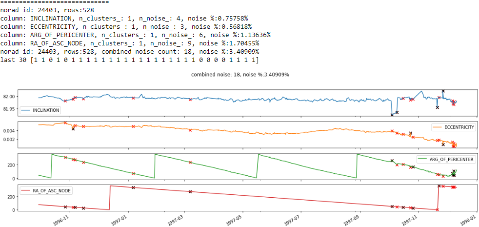
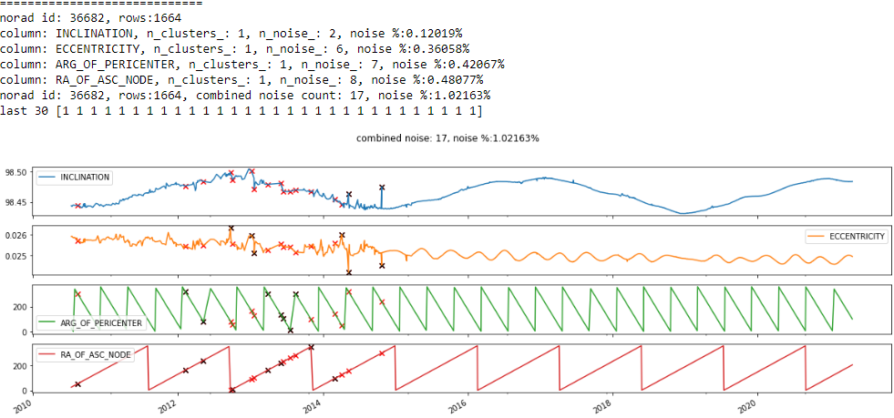

<link rel="stylesheet" href="/css/styles.css">
June 1, 2021

<dl>
<dt>Project Team</dt>
<dd>Nicholas Miller* (nmill@umich.edu)</dd>
<dd>Tim Chen* (ttcchen@umich.edu)</dd>
<dt>Github Repository</dt>
<dd><a href='https://github.com/cm-tle-pred/tle-prediction'>https://github.com/cm-tle-pred/tle-prediction</a></dd>
</dl>

\* equal contribution

# Table of Contents
<!-- TOC depthFrom:1 depthTo:3 withLinks:1 updateOnSave:1 orderedList:0 -->

- [Table of Contents](#table-of-contents)
- [Introduction](#introduction)
- [Data Source](#data-source)
	- [Raw Data](#raw-data)
	- [Pre-Processing](#pre-processing)
	- [Outlier Removal](#outlier-removal)
	- [Feature Engineering](#feature-engineering)
	- [Xy Generation](#xy-generation)
- [Supervised Learning](#supervised-learning)
	- [Workflow, Learning Methods and Feature Tuning](#workflow-learning-methods-and-feature-tuning)
		- [Challenges and Solutions](#challenges-and-solutions)
	- [Evaluation](#evaluation)
	- [Failure Analysis](#failure-analysis)
- [Unsupervised Learning](#unsupervised-learning)
	- [Motivation](#motivation)
	- [Unsupervised Learning Methods](#unsupervised-learning-methods)
	- [Unsupervised Evaluation](#unsupervised-evaluation)
- [Discussion](#discussion)
- [Statement of Work](#statement-of-work)
	- [Thank You](#thank-you)
- [Appendix](#appendix)
	- [A. What is a TLE?](#a-what-is-a-tle)
	- [B. Building the X-inputs and y-outputs](#b-building-the-x-inputs-and-y-outputs)
	- [C. Simple Neural Network Investigation](#c-simple-neural-network-investigation)
	- [D. Models Learning Data Shape](#d-models-learning-data-shape)
	- [E. Model Evaluation of Loss for N Models](#e-model-evaluation-of-loss-for-n-models)
	- [F. Anomaly detection with DBSCAN](#f-anomaly-detection-with-dbscan)

<!-- /TOC -->

# Introduction

Satellite positions can be calculated using publically available TLE (two-line element set) data.  See [Appendix A. What is a TLE?](#a-what-is-a-tle).  This standardized format has been used since the 1970s and can be used in conjunction with the SGP4 orbit model for satellite state propagation.  Due to many reasons, the accuracy of these propagations deteriorates when propagated beyond a few days.  Our project aimed to create better positional and velocity predictions which can lead to better maneuver and collision detection.

To accomplish this, a machine learning pipeline was created that takes in a TLE dataset and builds separate train, validate and test sets. The raw training set is sent to an unsupervised model for anomaly detection where outliers are removed and then feature engineering is performed.  Finally, supervised learning models were trained and tuned based on the validation set.  The model was designed so that it would accept a single TLE record for a satellite along with its epoch and an epoch modifier and then output a new TLE for the same satellite at the target epoch.

The models were trained on low-earth orbit (LEO) space debris objects with the expectation that they have relatively stable orbits.  This means active satellites that can maneuver were not used.  The resulting dataset, collected from [Space-Track.org](https://www.space-track.org/) via a public API, produced over 57 million TLE records for more than 21 thousand objects.

The general structure of a model was to have an input consisting of a reference TLE with its epoch along with a target epoch from another TLE for the same satellite with the output being that target's TLE data.  A performant model could then use the output in the SGP4 model for predicting a satellite's position at the target epoch.  The performance of the model was measured by comparing the model results with the actual target TLE.  Knowing that errors exist within a TLE, the expectation was that training on such a massive dataset would force the model to generalize and thus accurately predict new TLEs.

[Back to Top](#table-of-contents)


---


# Data Source


## Raw Data

TLE data from the [Space-Track.org](https://www.space-track.org/) `gp_history` API was used for this project.  Roughly 150 million entries of historical TLE data was downloaded into approximately 1,500 CSV files for processing.  Another dataset was obtained by scraping the [International Laser Ranging Services](https://ilrs.gsfc.nasa.gov) website to identify a list of satellites that have more accurate positional readings that we could use as our final evaluation metric.  [Sunspot data](http://www.sidc.be/silso/datafiles) from the World Data Center SILSO, Royal Observatory of Belgium, Brussels was used to indicate solar activity.  [Temperature data](http://berkeleyearth.lbl.gov/auto/Global/Land_and_Ocean_complete.txt) was downloaded from Berkley Earth (Rohde, R. A. and Hausfather, Z.: The Berkeley Earth Land/Ocean Temperature, Record Earth Syst. Sci. Data, 12, 3469–3479, 2020).


## Pre-Processing

After the raw data was collected, a list of Low Earth Orbit satellites was identified a training, testing, and validation set was created utilizing a 70/15/15 split.  The split was done on a satellite level, where data from the same satellite would be grouped in the same set to prevent data leakage.  The list of satellites included in the ILRS dataset was also distributed in the testing and validation set.  Due to the large amount of data, multiprocessing was utilized to ensure speedier processing.

After the basic LEO filtering and splits, the training set still contained over 55 million rows of data.  Further filters were done to increase data integrity:

 - **Recent data check** - Only data gathered after 1990 onwards, due to less accuracy, consistency, and frequency of data prior to that.
 - **First few check** - The first 5 entries of a satellite were discarded, as they tend to be less accurate when generated with less historical data.
 - **LEO check** - A satellite could no longer be classified with an LEO orbit as its orbit changes, entries that did not match the LEO requirements were removed.
 - **Data range check** - Finally, some data were corrupted and had values that were impossible to achieve, such as a `MEAN_MOTION` of 100.

With these filters, the amount of data is further reduced by 5 million rows.

## Outlier Removal

While the data which remained fell within the technical specifications, there were still some data that appeared to be outliers.  These data were likely to be misidentified as the wrong satellite or had suboptimal readings.  For more details on the outlier detection and removal, please read the [Unsupervised Learning](#unsupervised-learning) section.

## Feature Engineering

A TLE contains a few fields which can be used for SGP4 propagation ([Appendix A: What is a TLE](#a-what-is-a-tle)), however, to allow the models to achieve better accuracy, additional features were added to the dataset:

* Some features which were not part of the TLE data format that was included in the Space-Track provided data, such as `SEMIMAJOR_AXIS`, `PERIOD`, `APOAPSIS`, `PERIAPSIS`, and `RCS_SIZE` matched back with the TLE entries.
* Daily sunspot data with 1-day, 3-day, and 7-day rolling averages as well as monthly air and water temperatures from the external datasets were also mapped back to each TLE according to their `EPOCH` day and month.
* Some features exhibited periodic waveform patterns.  Cartesian representations of these features were added as extra features.
* Some features represented modulo values, pseudo reverse modulus representations were generated for these features so that their linear nature is represented.
* Cartesian representation of position and velocity using the SGP4 algorithm were also added as additional features.

Please reference [Appendix G: Feature Engineering](#g-feature-engineering) for full details of all the features which were added to the dataset.

[Back to Top](#table-of-contents)

----


# Supervised Learning
> * Briefly describe the workflow of your source code, the learning methods you used, and the feature representations you chose.
> * How did you tune parameters?
> * What challenges did you encounter and how did you solve them?

*We plan to start with a Linear Regression and a simple NN with a single layer using a sample of the dataset as baseline models before moving on to a deep neural network (DNN).  Our data will consist of a normalized set of TLE variables with a target epoch as our input variables and the normalized TLE variables at the target epoch as the output variables. To account for natural effects that impact orbital mechanics, we will combine additional datasets on climate change, global temperature, solar cycles, and solar sunspots to improve accuracy.*

## Workflow, Learning Methods and Feature Tuning [NICK]

Pytorch was the library selected for building and training a model.  At first, a simple fully-connected network consisting of only one hidden layer was created and trained.  Deeper networks with a varying number of hidden layers and widths were created, utilizing the ReLU activation function and dropout.  More advanced models were employed next including a regression version of a ResNet28 model based on a paper by [Chen D. et al, 2020 "Deep Residual Learning for Nonlinear Regression"](https://www.mdpi.com/1099-4300/22/2/193).  A Bilinear model was also created with the focus of correcting for the difference between the output feature and the input feature of the same name.

To get a feel for how a model would train and could be evaluated, the simple fully-connected neural network with only one hidden layer was trained and hyperparameters were tuned.  Due to the size of the training set, a subset of the training set was also used.  During this investigation, changes to data filtering were made to eliminate the training on bad data.  See Appendix [C. Simple Neural Network Investigation](#c-simple-neural-network-investigation) for further details.

In later models, SGD and AdamW optimizers were experimented with.  AdamW resulted in faster learning so was generally preferred.  Understanding the AdamW doesn't generalize as well as SGD, we relied on our volume of data and utilizing dropout for generalizing and never ran into issues with overfitting.  At this stage, the models were starting to show some progress in capturing the shape of the data.  See Appendix [D. Models Learning Data Shape](#d-models-learning-data-shape).  To see how performance could be further improved, separate models were trained for each output feature.  This resulted in better capture of data shape.

During training, the loss values were monitored and corrections were made to the learning rate to prevent overfitting and decrease model training times.  This required the saving of models and evaluating at each epoch and then restoring models to previous versions when training went awry.


## Simple Neural Network Investigation [NICK]


## Random Pair Model [NICK]

### Xy Generation (why random pairs)

Blah

### Describe the models (ResNet + predicting absolute)

Blah


## Neighboring Pair Model [TIM]

### Xy Generation (why neighboring pairs)

Blah

### Describe the models (BiLinear + predicting offsets)

Blah


[Back to Top](#table-of-contents)

---


## Evaluation
> * Provide a correct and comprehensive evaluation, analyzing the effectiveness of both your methods, and your feature representations. Methods include e.g. ablation tests to identify important features, hyperparameter sensitivity, and training data curves. This should be done for each learning framework and representation choice, together with a valid and effective comparison between the chosen approaches.
> * Which features were most important and why?
> * What important tradeoffs can you identify?
> * How sensitive are your results to choice of parameters, features, or other varying solution elements?

*Mean square error on the baseline models’ predictions will be used as benchmarks for evaluation.  We will also consider using a custom loss function on predicted spatial x, y, z positions.  To visualize the model's effectiveness, we can plot propagated satellite positions using the SGP4, our baseline models, the DNN model against the true dataset (other TLEs) together in 3D.  Visualizing the errors for the models based on individual feature variances will also show where the strengths and weaknesses of the models lie.*

---
The model evaluations took place on two different sets of training data that were assembled differently based on the raw training data.  In one approach, we'll call the `N` models, each TLE input was paired with a random TLE output for the same satellite.  This resulted in two TLEs (an input and an output) that would have a random time difference between them spanning days, weeks, or even years apart.  In another approach, we'll call the `T` models, each TLE input for a satellite was paired with its sisters resulting in a larger training set but then reduced by limiting their time difference to 14 days.  See Appendix [B. Building the X-inputs and y-outputSize](#b-building-the-x-inputs-and-y-outputs) for more details.

The `N` models, while showing signs that convergence, converged much less quickly than the `T` models.  During this time, it was established that the training loss necessary to compete with the SGP4 propagation model needed to be on an order of `1e-8` or smaller.  The `N` and `T` models were changed so that separate models would be trained for each output feature.  The `N` models did show some major improvement but not at the level of the `T` models.  For more details, please see Appendix [E. Model Evaluation of Loss for N Models](#e-model-evaluation-of-loss-for-n-models).


## Failure Analysis
> * Select three examples where prediction failed, and analyse why. You should be able to find at least three different types of failure.
Talk here about copying X values

[Back to Top](#table-of-contents)

---

# Unsupervised Learning

## Motivation

Due to the impact of outliers in TLE data on the supervised learning models, the use of unsupervised learning models were explored to remove these abnormal data from the training dataset before using them to train our neural network models.  Consistent patterns were observed in the first-order or second-order differences when examining data from the same satellite.  `DBSCAN` was selected to exploit this as regular data points are clustered together and data points which have abnoramlly large or small values relative to other data points in the series will be classified as outliers.

## Unsupervised Learning Methods

As data are highly correlated between samples from the same satellite, the raw TLE entries are first grouped by their `NORAD_ID` and then sorted in ascending order according to the `EPOCH`.  Then, the values for the first-order difference for `INCLINATION` and `ECCENTRICITY` used as inputs to `DBSCAN`.  The algorithm clusters similar values and isolated values with abnormally large jumps with its neighbors.

Initially, a single `DBSCAN` model was created for both `INCLINATION` and `ECCENTRICITY` as input features, however, it was more reliant on how the normalization was done and was less sensitive to anomalies from a single feature.  Although it required more computation time, training separate `DBSCAN` models resulted in less data manipulation and better results once combined.

As initial predictions for the neural networks were evaluated, additional `DBSCAN` models were created to eliminate outliers from `ARG_OF_PERICENTER` and `RA_OF_ASC_NODE` by examining their second-order difference, resulting in a total of four `DBSCAN` models per satellite.

Due to the large variance in size and values for individual satellites, the `min_sample` and `eps` parameters could not be static and must be dynamically adjusted for individual satellites.  To accommodate satellites with both small and large amount of data, the `min_sample` was set to require at least 20 samples or 1% of the total size of the data, whichever was greater.

The `eps` parameter was tuned accordingly with the features characteristics.  A higher `eps` value would lead to the removal of more extreme outliers, while a lower `eps` could potentially remove borderline but valid values.  Ultimately, 3 times the standard deviation of the first-order difference was used for `INCLINATION` and `ECCENTRICITY`, and the standard deviation of the second-order difference was used for `ARG_OF_PERICENTER` and `RA_OF_ASC_NODE`.

## Unsupervised Evaluation

The anomaly detection was successful in identifying many outliers, such as those which had their `NORAD_ID`s attributed incorrectly or feature values that were highly irregular.  However, it failed to catch consecutive outliers and it also falsely classified some valid data as an anomaly.

Misclassifying outliers generally fall under three categories.  First, a higher amount of misclassification occurred during periods of increased solar activity, as additional orbital perturbations are normal during this time.  Second, as satellites deorbit as they enter the Earth's atmosphere, additional drag also causes the input features to vary more.  Finally, as the TLE data is reported with regular intervals, if some observations are missed, the next sample would result in a greater difference value.

On examining these false positives, it was decided that these were tolerable, as the dataset contained a huge amount of data, falsely removing some of these normal data, even in niche circumstances, still generally accounted for less than 2% of the data.  See [Appendix F. Anomaly Detection with `DBSCAN`](#f-anomaly-detection-with-dbscan) for data points marked for removal by the `DBSCAN` models.

[Back to Top](#table-of-contents)

---


# Challenges and Solutions

## REV_MA [TIM]

Blah

## Custom Loss [TIM]

Blah

## Additional DBSCAN features [TIM]

Blah

## Loss + Optimizers parameter optimization with Schedulers [NICK]

> TIM NOTE: copied from older section

Our biggest challenge was a vanishing gradient where our models loss would exponentially decay.  To address this problem, we would first look at tuning the learning rate.  We then explored different model architectures: deeper and narrower, shallower and wider, bilinear and ResNet28.  After reading [Loshchilov & Hutter's paper "Decoupled Weight Decay Regularization"](https://arxiv.org/abs/1711.05101), we explorered different optimizers and mostly settling on AdamW while always circling back to turning other hyperparameters like learning rate and model architecture.  We also had some success using the OneCycle scheduler that increases and then decreases the learning rate over each batch introduced by [Smith L. & Topin N. in their 2018 paper "Super-Convergence: Very Fast Training of Neural Networks Using Large Learning Rates"](https://arxiv.org/abs/1708.07120).


## Configurable flexible model creation [NICK]

Blah

## Saving / loading model and rollback [TIM]

Blah


[Back to Top](#table-of-contents)

---


# Discussion
> * What did you l earn from doing Part A? What surprised you about your results? How could you extend your solution with more time/resources?
> * What did you l earn from doing Part B? What surprised you about your results? How could you extend your solution with more time/resources?
> * What ethical i ssues could arise i n providing a solution to Part A, and how could you address them?
> * What ethical i ssues could arise i n providing a solution to Part B, and how could you address them?

[Back to Top](#table-of-contents)

---

# Statement of Work

<dl>
    <dt>Nicholas Miller</dt>
    <dd>Data split strategy</dd>
    <dd>Feature Engineering</dd>
    <dd>Initial neural network models</dd>
    <dd>Random Pair Model</dd>
    <dd>Training and Evaluation</dd>
    <dd>Final Report</dd>
    <dt>Tim Chen</dt>
    <dd>Data collection</dd>
    <dd>Feature Engineering</dd>
    <dd>Unsupervised learning outlier detection models</dd>
    <dd>Neighboring Pair Model</dd>
    <dd>Training and Evaluation</dd>
    <dd>Final Report</dd>
</dl>

## Thank You
We would like to extend a special thank you to the following people who went above and beyond to help us with this project.

**Professor Christopher Brooks**

> Thank you Chris for kindly making available your high computing resources, nellodee, for this project.  This proved to be instrumental in  handling this massive dataset and for allowing us to run models 24/7 while utilizing ungodly amounts of RAM.

**Professor Patrick Seitzer**

> Thank you Pat for your patience in helping us understand orbital mechanics and providing us with additional reference materials.

[Back to Top](#table-of-contents)

---
<p style="page-break-before: always"></p>

# Appendix

## A. What is a TLE?
A two-line element set (TLE) is a standardized format for describing a satellite's orbit and trajectory.  Below is an example for the International Space Station.

	ISS (ZARYA)
	1 25544U 98067A   08264.51782528 -.00002182  00000-0 -11606-4 0  2927
	2 25544  51.6416 247.4627 0006703 130.5360 325.0288 15.72125391563537
<p align='center'>Example TLE for the International Space Station<br><i>Source: Wikipedia</i></p>

A TLE contains 14 fields, from this, only 9 of these are necessary for the SGP4 algorithm.  A target EPOCH is also necessary for the SGP4 algorithm to propagate target position and velocity vectors.

- Epoch Year - The year the TLE was calculated
- Epoch Day - The day and fraction of the day the TLE was calculated
- B-star - The drag term or radiation pressure coefficient
- Inclination - Satellite orbit tilt between 0 and 180 degrees
- Right Ascension of the Ascending Node - Ranging from 0 to 360 degrees
- Eccentricity - A measure of how circular the orbit is ranging from 0 to 0.25 for LEO satellites
- Argument of Perigee - The angle from the ascending node ranging from 0 to 360 degrees
- Mean Anomaly - The angular position measured from pericenter if the orbit was circular ranging from 0 to 360 degrees
- Mean Motion - The angular speed necessary to complete one orbit measured in revolutions per day with a minimum of 11.25 for LEO satellites

[Back to Top](#table-of-contents)

<p style="page-break-before: always"></p>

## B. Building the X-inputs and y-outputs


<p align='center'><b>Figure B1</b>  How a X/Y pair was generated</p>


||BSTAR|	INCLINATION|	RA_OF_ASC_NODE|	ECCENTRICITY|	ARG_OF_PERICENTER|	MEAN_ANOMALY|	MEAN_MOTION
|-:|-:|-:|-:|-:|-:|-:|-:|
|0|0.002592|62.2415|180.1561|0.070489|265.6761|86.2771|12.852684|
|1|0.000100|73.3600|345.6887|0.008815|270.3999|88.6911|12.642166|
|2|0.001076|83.0239|250.9465|0.008493|184.3222|175.7249|13.856401|
|3|0.000166|70.9841|207.4830|0.020756|161.3777|199.5075|13.715209|
|4|0.000739|90.1460|192.1834|0.002746|300.4617|59.3655|12.992417|

<p align='center'><b>Table B1</b>  Example Raw Y-outputs (not normalized)</p>

[Back to Top](#table-of-contents)

<p style="page-break-before: always"></p>

## C. Simple Neural Network Investigation

|Test L1 Loss | Test L2 Loss | Change History | Time |
|:-|:-|:-|-|
|0.1234|21.7614|norads=10%, epochs=10, batchSize=200,<br> learn=0.0001, device=cpu, loss=l2,<br> num_workers=5, hidden=300|28min 39s|
|0.1235|34.4868|num_workers=20|28min 54s|
|0.1222|30.8207|norads=20%, num_workers=5|53min 47s|
|0.1219|26.2414|norads=5%, tles-after-1990|12min 46s|
|0.1217|0.1226|remove-high-mean-motion|13min 22s|
|0.1211|0.1235|norads=10%|27min 35s|
|0.1221|0.1232|hidden=10|22min 33s|
|0.1330|0.1380|updated mean_motion standardization|24min 16s|
|0.1329|0.1380|norads=5%|12min 36s|
|0.1322|0.1385|run-local|6min 18s|
|0.1302|0.1373|num-workers=10|4min 44s|
|0.1302|0.1373|num-workers=10|4min 44s|
|0.1304|0.0631|remove-high-bstar|4min 37s|
|0.1289|0.0601|hidden=300|8min 31s|
|0.1423|0.0652|hidden1=100, hidden2=100, drop=50%,<br>batchSize=2000, epoch=5|2min 51s|
|0.1397|0.0614|hidden1=300, drop=50%,<br>hidden2=100, drop=50%,<br>hidden3=10, drop=50%,<br>hidden4=10, drop=50%,<br>hidden5=10, drop=50%,<br>batchSize=2000, epoch=10, learn=0.01|6min 12s|

<p align='center'><b>Table C1</b>  Simple Network Change History</p>

For the last few entries, a new model was created that could be initalized with varying number of layers, widths, activation fuctions and dropout:

```python
model = train.create_model(model_cols=model_cols,
                           layer1=300, relu1=True, drop1=0.5,
                           layer2=100, relu2=True, drop2=0.5,
                           layer3=10, relu3=True, drop3=0.5,
                           layer4=10, relu4=True, drop4=0.5,
                           layer5=10, relu5=True, drop5=0.5,
                          )

class NNModelEx(nn.Module):
    def __init__(self, inputSize, outputSize, **kwargs):
        super().__init__()

        network = []
        p = inputSize
        for k,v in kwargs.items():
            if k.startswith('l'):
                network.append(nn.Linear(in_features=p, out_features=v))
                p=v
            elif k.startswith('d'):
                network.append(nn.Dropout(v))
            elif k.startswith('t'):
                network.append(nn.Tanh())
            elif k.startswith('s'):
                network.append(nn.Sigmoid())
            elif k.startswith('r'):
                network.append(nn.ReLU())

        network.append(nn.Linear(in_features=p, out_features=outputSize))
        #network.append(nn.ReLU())

        self.net = nn.Sequential(*network)

    def forward(self, X):
        return self.net(X)
```

	NNModelEx(
	  (net): Sequential(
	    (0): Linear(in_features=X, out_features=300, bias=True)
	    (1): ReLU()
	    (2): Dropout(p=0.5, inplace=False)
	    (3): Linear(in_features=300, out_features=100, bias=True)
	    (4): ReLU()
	    (5): Dropout(p=0.5, inplace=False)
	    (6): Linear(in_features=100, out_features=10, bias=True)
	    (7): ReLU()
	    (8): Dropout(p=0.5, inplace=False)
	    (9): Linear(in_features=10, out_features=10, bias=True)
	    (10): ReLU()
	    (11): Dropout(p=0.5, inplace=False)
	    (12): Linear(in_features=10, out_features=10, bias=True)
	    (13): ReLU()
	    (14): Dropout(p=0.5, inplace=False)
	    (15): Linear(in_features=10, out_features=Y, bias=True)
	  )
	)

[Back to Top](#table-of-contents)

<p style="page-break-before: always"></p>

## D. Models Learning Data Shape

For the satellite NORAD 10839, the Mean Motion and Right Ascension of the Ascending Node are starting to take shape.  This earlier model did not convert some cyclical features resulting in the sawtooth ground truths.  Later models converted these features to cyclical features and greatly improved their prediction.


The same can be seen in NORAD 27944.


When limiting the models prediction to 14 days and having a separate model for each output feature, the shape of the data is very well preserved as can be seen with NORAD 12701.


Zooming in on a 1-year period of the previous makes the error more observable.


[Back to Top](#table-of-contents)

<p style="page-break-before: always"></p>

## E. Model Evaluation of Loss for N Models

Below is a table showing the optimum loss achieved at 25 epochs for each model evolution.

|*v*|Model Description|Train Loss<br><small>25 Epochs</small>|Validation Loss<br><small>25 Epochs</small>|
|-:|:-|-:|-:|
|1|3 fully connected layers<br>width of 100 each hidden layer<br>ReLU between layers  |0.03848|0.5963|
|2|ResNet28 (nonlinear regression)<br>width of 256<br>optimizer Adam|0.03159|0.5297|
|3|ResNet28 (nonlinear regression)<br>width of 256<br>optimizer AdamW w/ `weight_decay=0.00025` |0.02487|1.601|
|4|ResNet28 (nonlinear regression)<br>width of 256<br>optimizer SGD|0.03276|19.44|
|5|ResNet28 (nonlinear regression)<br>width of 128 (single output)<br>optimizer SGD<br>OneCycle scheduler to epoch 10<br>then switched to AdamW|5.176e-06|7.604e-07|

<p align='center'><b>Table E1</b>  <code>N</code> variant model evolution</p>

Within each model evolution, hyperparameter tuning took place resulting in various loss trails.






From this point, a separate model was trained for each output feature.





[Back to Top](#table-of-contents)

<p style="page-break-before: always"></p>


## F. Anomaly Detection with DBSCAN

Below are the anomaly detection results with the DBSCAN models from selected satellites.


<p align='center'><i>NORAD ID: 24403.  PEGASUS DEB (1994-029RG)</i></p>

-------


<p align='center'><i>NORAD ID: 36682.  FENGYUN 1C DEB (1999-025DZC)</i></p>

[Back to Top](#table-of-contents)

<p style="page-break-before: always"></p>

## G. Feature Engineering

Below is a table showing details of the features added to the dataset.  While all of these features are available, each model may use a different subset of features for training.

| Feature Name | Description | Reason |
|:-|:-|:-|
| `EPOCH_JD` | A | B |
| `EPOCH_FR` | A | B |
| `MEAN_MOTION_DOT` | A | B |
| `BSTAR` | A | B |
| `INCLINATION` | A | B |
| `RA_OF_ASC_NODE` | A | B |
| `ECCENTRICITY` | A | B |
| `ARG_OF_PERICENTER` | A | B |
| `YEAR` | A | B |
| `MEAN_ANOMALY` | A | B |
| `MEAN_MOTION` | A | B |
| `MEAN_ANOMALY_COS` | A | B |
| `MEAN_ANOMALY_SIN` | A | B |
| `INCLINATION_COS` | A | B |
| `INCLINATION_SIN` | A | B |
| `RA_OF_ASC_NODE_COS` | A | B |
| `RA_OF_ASC_NODE_SIN` | A | B |
| `SEMIMAJOR_AXIS` | A | B |
| `PERIOD` | A | B |
| `APOAPSIS` | A | B |
| `PERIAPSIS` | A | B |
| `RCS_SIZE` | A | B |
| `SAT_RX` | A | B |
| `SAT_RY` | A | B |
| `SAT_RZ` | A | B |
| `SAT_VX` | A | B |
| `SAT_VY` | A | B |
| `SAT_VZ` | A | B |
| `YEAR` | A | B |
| `DAY_OF_YEAR_COS` | A | B |
| `DAY_OF_YEAR_SIN` | A | B |
| `SUNSPOTS_1D` | A | B |
| `SUNSPOTS_3D` | A | B |
| `SUNSPOTS_7D` | A | B |
| `AIR_MONTH_AVG_TEMP` | A | B |
| `WATER_MONTH_AVG_TEMP` | A | B |
| `ARG_OF_PERICENTER_ADJUSTED` | A | B |
| `RA_OF_ASC_NODE_ADJUSTED` | A | B |
| `REV_MEAN_ANOMALY_COMBINED` | A | B |


[Back to Top](#table-of-contents)

-------
